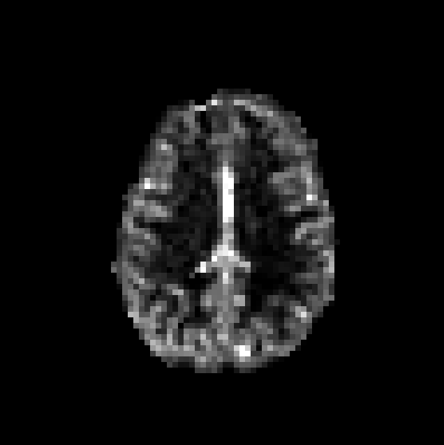
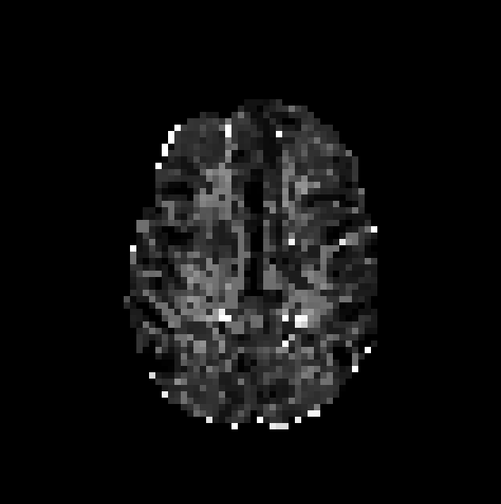
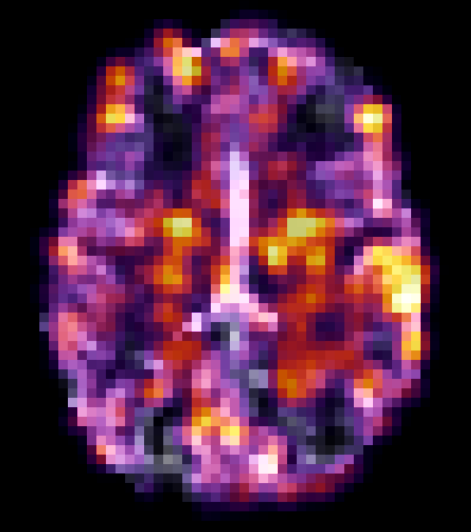

# ASL Processing Workflow Examples

This document provides comprehensive examples of using the asltk library for various ASL processing workflows. Each example includes practical code snippets, parameter explanations, and result interpretation guidance.

## Table of Contents

- [ASL Processing Workflow Examples](#asl-processing-workflow-examples)
  - [Table of Contents](#table-of-contents)
  - [Basic CBF Mapping Workflow](#basic-cbf-mapping-workflow)
    - [Expected Results](#expected-results)
    - [Example CBF and ATT Maps](#example-cbf-and-att-maps)
  - [Multi-Echo ASL Analysis](#multi-echo-asl-analysis)
    - [Example Multi-TE Results](#example-multi-te-results)
  - [Ultra-Long TE ASL Mapping](#ultra-long-te-asl-mapping)
  - [Diffusion-Weighted ASL Analysis](#diffusion-weighted-asl-analysis)
  - [Complete Analysis Pipeline](#complete-analysis-pipeline)
  - [Best Practices and Tips](#best-practices-and-tips)
    - [Performance Optimization](#performance-optimization)
    - [Parameter Selection](#parameter-selection)
    - [Quality Assessment](#quality-assessment)
    - [Troubleshooting](#troubleshooting)

## Basic CBF Mapping Workflow

This example shows the standard ASL processing workflow for generating CBF and ATT maps.

```python
from asltk.asldata import ASLData
from asltk.reconstruction import CBFMapping
from asltk.utils.io import ImageIO
import numpy as np

# Step 1: Load ASL data
asl_data = ASLData(
    pcasl='./data/pcasl.nii.gz',          # ASL time series
    m0='./data/m0.nii.gz',                # M0 reference image
    ld_values=[1.8, 1.8, 1.8],           # Labeling durations (s)
    pld_values=[0.8, 1.8, 2.8]           # Post-labeling delays (s)
)

# Step 2: Create CBF mapper
cbf_mapper = CBFMapping(asl_data)

# Step 3: Set brain mask (recommended for speed and quality)
brain_mask = ImageIO(image_array='./data/brain_mask.nii.gz')
cbf_mapper.set_brain_mask(brain_mask)

# Step 4: Generate CBF and ATT maps
# Note: All parameters (ub, lb, par0, cores) have default values and are optional
# You can simply call: results = cbf_mapper.create_map() for default behavior
results = cbf_mapper.create_map()

# Step 5: Access and save results
cbf_map = results['cbf_norm']    # CBF in mL/100g/min
att_map = results['att']         # ATT in milliseconds
cbf_raw = results['cbf']         # Raw CBF values

# Save results
# Important: Image saving formats are limited to asltk API settings
# Available formats: .nii, .nii.gz, .mha, .nrrd (see save_image documentation)
cbf_map.save('./results/cbf_map.nii.gz')
att_map.save('./results/att_map.nii.gz')

# Step 6: Quality assessment
print(f"CBF range: {cbf_map.get_as_numpy().min():.1f} - {cbf_map.get_as_numpy().max():.1f} mL/100g/min")
print(f"Mean CBF: {np.mean(cbf_map.get_as_numpy()[brain_mask > 0]):.1f} mL/100g/min")
print(f"ATT range: {att_map.get_as_numpy().min():.0f} - {att_map.get_as_numpy().max():.0f} ms")
print(f"Mean ATT: {np.mean(att_map.get_as_numpy()[brain_mask > 0]):.0f} ms")
```

### Expected Results
- **Healthy CBF values**: 50-80 mL/100g/min (grey matter), 20-30 mL/100g/min (white matter)
- **Healthy ATT values**: 800-2000 ms depending on vascular territory

### Example CBF and ATT Maps



A CBF map example, using multi PLD ASL imaging acquisition



An ATT map example, using multi PLD ASL imaging acquisition


## Multi-Echo ASL Analysis

This example demonstrates multi-TE ASL processing for T1 relaxometry and enhanced tissue characterization.

```python
from asltk.asldata import ASLData
from asltk.reconstruction import MultiTE_ASLMapping
from asltk.utils.io import ImageIO
import numpy as np

# Step 1: Load multi-TE ASL data
asl_data = ASLData(
    pcasl='./data/pcasl_multi_te.nii.gz',
    m0='./data/m0.nii.gz',
    te_values=[13.2, 25.7, 50.4],        # Echo times (ms)
    ld_values=[1.8, 1.8, 1.8],
    pld_values=[0.8, 1.8, 2.8]
)

# Step 2: Create multi-TE mapper
mte_mapper = MultiTE_ASLMapping(asl_data)

# Step 3: Set brain mask
brain_mask = ImageIO(image_array='./data/brain_mask.nii.gz')
mte_mapper.set_brain_mask(brain_mask)

# Step 5: Generate multi-TE maps
results = mte_mapper.create_map()

# Step 6: Access results
cbf_norm = results['cbf_norm']      # Normalized CBF
att_map = results['att']            # Arterial transit time
t1blgm_map = results['t1blgm']      # T1 blood-grey matter exchange

# Step 7: Save results
cbf_norm.save('./results/mte_cbf.nii.gz')
att_map.save('./results/mte_att.nii.gz')
t1blgm_map.save('./results/t1blgm.nii.gz')

# Step 8: Analysis
print(f"T1blGM range: {t1blgm_map.get_as_numpy().min():.0f} - {t1blgm_map.get_as_numpy().max():.0f} ms")
print(f"Mean T1blGM: {np.mean(t1blgm_map.get_as_numpy()[brain_mask > 0]):.0f} ms")

# Typical T1blGM values:
# Grey matter: 200-600 ms (faster exchange)
# White matter: 400-800 ms (slower exchange)
```

### Example Multi-TE Results



A T1 blood-GM map example, using the Multi TE ASL imaging acquisition

## Ultra-Long TE ASL Mapping

This example demonstrates ultra-long TE ASL processing for improved tissue characterization.

```python
from asltk.asldata import ASLData
from asltk.reconstruction import UltraLongTE_ASLMapping
from asltk.utils.io import ImageIO
import numpy as np

# Step 1: Load ultra-long TE ASL data
asl_data = ASLData(
    pcasl='./data/pcasl_ultra_long_te.nii.gz',
    m0='./data/m0.nii.gz',
    te_values=[100, 200, 300],          # Echo times (ms)
    ld_values=[1.8, 1.8, 1.8],
    pld_values=[0.8, 1.8, 2.8]
)

# Step 2: Create ultra-long TE mapper
ulte_mapper = UltraLongTE_ASLMapping(asl_data)

# Step 3: Set brain mask (optional but recommended)
brain_mask = ImageIO(image_array='./data/brain_mask.nii.gz')
ulte_mapper.set_brain_mask(brain_mask)

# Step 5: Generate ultra-long TE maps
results = ulte_mapper.create_map()

# Step 6: Access results
cbf_norm = results['cbf_norm']      # Normalized CBF
att_map = results['att']            # Arterial transit time
t1csfgm_map = results['t1csfgm']      # T1 CSF-grey matter exchange

# Step 7: Save results
save_image(cbf_norm, './results/ulte_cbf.nii.gz')
save_image(att_map, './results/ulte_att.nii.gz')
save_image(t1csfgm_map, './results/t1csfgm.nii.gz')

# Step 8: Analysis
print(f"T1csfGM range: {t1csfgm_map.min():.0f} - {t1csfgm_map.max():.0f} ms")
print(f"Mean T1csfGM: {np.mean(t1csfgm_map[brain_mask > 0]):.0f} ms")
```

## Diffusion-Weighted ASL Analysis

This example shows multi-DW ASL processing for compartment analysis and diffusion characterization.

```python
from asltk.asldata import ASLData
from asltk.reconstruction import MultiDW_ASLMapping
from asltk.utils.io import ImageIO, clone_image
import numpy as np

# Step 1: Load multi-DW ASL data
asl_data = ASLData(
    pcasl='./data/pcasl_multi_dw.nii.gz',
    m0='./data/m0.nii.gz',
    dw_values=[0, 50, 100, 200],          # b-values (s/mm²)
    ld_values=[1.8, 1.8, 1.8, 1.8],
    pld_values=[0.8, 1.8, 2.8, 3.8]
)

# Step 2: Create multi-DW mapper
mdw_mapper = MultiDW_ASLMapping(asl_data)

# Step 3: Set conservative brain mask (important for processing time)
brain_mask = ImageIO(image_array='./data/brain_mask.nii.gz')
# Create more conservative mask for initial testing
conservative_mask = clone_image(brain_mask).get_as_numpy()
conservative_mask[0:2, :, :] = 0      # Remove edge slices
conservative_mask[-2:, :, :] = 0      # Remove edge slices
mdw_mapper.set_brain_mask(conservative_mask)

print(f"Processing {np.sum(conservative_mask)} voxels (reduced from {np.sum(brain_mask)})")

# Step 4: Generate multi-DW maps (this may take 30+ minutes)
print("Starting multi-DW processing... (this may take a while)")
results = mdw_mapper.create_map()

# Step 5: Access compartment results
cbf_norm = results['cbf_norm']          # Normalized CBF
att_map = results['att']                # Arterial transit time
A1_map = results['A1']                  # Fast compartment amplitude
D1_map = results['D1']                  # Fast compartment diffusion
A2_map = results['A2']                  # Slow compartment amplitude
D2_map = results['D2']                  # Slow compartment diffusion
kw_map = results['kw']                  # Water exchange parameter

# Step 6: Save all results
cbf_norm.save('./results/mdw_cbf.nii.gz')
att_map.save('./results/mdw_att.nii.gz')
A1_map.save('./results/A1_fast_compartment.nii.gz')
D1_map.save('./results/D1_fast_diffusion.nii.gz')
A2_map.save('./results/A2_slow_compartment.nii.gz')
D2_map.save('./results/D2_slow_diffusion.nii.gz')
kw_map.save('./results/water_exchange.nii.gz')

# Step 7: Analysis and interpretation
mask_indices = conservative_mask > 0
print(f"Fast diffusion (D1) range: {D1_map.get_as_numpy()[mask_indices].min():.2e} - {D1_map.get_as_numpy()[mask_indices].max():.2e} mm²/s")
print(f"Slow diffusion (D2) range: {D2_map.get_as_numpy()[mask_indices].min():.2e} - {D2_map.get_as_numpy()[mask_indices].max():.2e} mm²/s")
print(f"Amplitude ratio (A1/A2): {np.mean(A1_map.get_as_numpy()[mask_indices]/A2_map.get_as_numpy()[mask_indices]):.2f}")

# Typical interpretations:
# D1 > D2: Fast compartment likely represents intravascular component
# A1/A2 ratio: Relative contribution of each compartment
# Higher kw: Faster water exchange between compartments
```

## Complete Analysis Pipeline

This example demonstrates a complete ASL analysis pipeline comparing different reconstruction methods.

```python
from asltk.asldata import ASLData
from asltk.reconstruction import CBFMapping, MultiTE_ASLMapping
from asltk.utils.io import ImageIO
from asltk.utils.image_manipulation import collect_data_volumes
import numpy as np

# Step 1: Load comprehensive ASL dataset
asl_data = ASLData(
    pcasl='./data/pcasl_complete.nii.gz',
    m0='./data/m0.nii.gz',
    ld_values=[1.8, 1.8, 1.8],
    pld_values=[0.8, 1.8, 2.8],
    te_values=[13.2, 25.7, 50.4]         # Multi-TE capability
)

# Step 2: Data exploration
print(f"ASL data shape: {asl_data('pcasl').get_as_numpy().shape}")
print(f"M0 data shape: {asl_data('m0').get_as_numpy().shape}")
print(f"LD values: {asl_data.get_ld()} s")
print(f"PLD values: {asl_data.get_pld()} s")
print(f"TE values: {asl_data.get_te()} ms")

# Extract individual volumes for quality assessment
volumes, original_shape = collect_data_volumes(asl_data('pcasl'))
print(f"Extracted {len(volumes)} individual volumes")

# Step 3: Basic CBF mapping
print("\n=== Basic CBF Mapping ===")
cbf_mapper = CBFMapping(asl_data)
brain_mask = ImageIO(image_array='./data/brain_mask.nii.gz')
cbf_mapper.set_brain_mask(brain_mask)

basic_results = cbf_mapper.create_map(cores=4)
basic_cbf = basic_results['cbf_norm'].get_as_numpy()
basic_att = basic_results['att'].get_as_numpy()

print(f"Basic CBF - Mean: {np.mean(basic_cbf[brain_mask > 0]):.1f} mL/100g/min")
print(f"Basic ATT - Mean: {np.mean(basic_att[brain_mask > 0]):.0f} ms")

# Step 4: Multi-TE ASL mapping
print("\n=== Multi-TE ASL Mapping ===")
mte_mapper = MultiTE_ASLMapping(asl_data)
mte_mapper.set_brain_mask(brain_mask)

# Use basic CBF/ATT as input for multi-TE analysis
mte_mapper.set_cbf_map(basic_results['cbf'])
mte_mapper.set_att_map(basic_results['att'])

mte_results = mte_mapper.create_map(
    par0=[400.0],     # Initial guess for T1blGM
    cores=4
)

mte_cbf = mte_results['cbf_norm'].get_as_numpy()
mte_t1blgm = mte_results['t1blgm'].get_as_numpy()

print(f"Multi-TE CBF - Mean: {np.mean(mte_cbf[brain_mask > 0]):.1f} mL/100g/min")
print(f"T1blGM - Mean: {np.mean(mte_t1blgm[brain_mask > 0]):.0f} ms")

# Step 5: Save all results with organized naming
basic_cbf.save('./results/basic_cbf.nii.gz')
basic_att.save('./results/basic_att.nii.gz')
mte_cbf.save('./results/multite_cbf.nii.gz')
mte_t1blgm.save('./results/t1blgm_map.nii.gz')

# Step 6: Comparison analysis
print("\n=== Method Comparison ===")
cbf_difference = mte_cbf.get_as_numpy() - basic_cbf.get_as_numpy()
print(f"CBF difference (Multi-TE - Basic): {np.mean(cbf_difference[brain_mask > 0]):.1f} ± {np.std(cbf_difference[brain_mask > 0]):.1f} mL/100g/min")

# Step 7: Regional analysis (example with simple ROIs)
# Create simple GM/WM masks based on CBF thresholds
gm_mask = (basic_cbf.get_as_numpy() > 40) & (brain_mask.get_as_numpy() > 0)  # High CBF regions (GM)
wm_mask = (basic_cbf.get_as_numpy() <= 40) & (basic_cbf.get_as_numpy() > 10) & (brain_mask.get_as_numpy() > 0)  # Lower CBF regions (WM)

print(f"\nRegional Analysis:")
print(f"GM CBF: {np.mean(basic_cbf.get_as_numpy()[gm_mask]):.1f} ± {np.std(basic_cbf.get_as_numpy()[gm_mask]):.1f} mL/100g/min")
print(f"WM CBF: {np.mean(basic_cbf.get_as_numpy()[wm_mask]):.1f} ± {np.std(basic_cbf.get_as_numpy()[wm_mask]):.1f} mL/100g/min")
print(f"GM T1blGM: {np.mean(mte_t1blgm.get_as_numpy()[gm_mask]):.0f} ± {np.std(mte_t1blgm.get_as_numpy()[gm_mask]):.0f} ms")
print(f"WM T1blGM: {np.mean(mte_t1blgm.get_as_numpy()[wm_mask]):.0f} ± {np.std(mte_t1blgm.get_as_numpy()[wm_mask]):.0f} ms")

print(f"\nResults saved to ./results/ directory")
```

## Best Practices and Tips

### Performance Optimization

1. **Use Brain Masks**: Always use brain masks to reduce processing time and improve results quality.
   ```python
   # Conservative mask for initial testing
   brain_mask_array = brain_mask.get_as_numpy()
   conservative_mask = brain_mask_array.copy()
   conservative_mask[brain_mask_array < np.percentile(brain_mask_array[brain_mask_array > 0], 50)] = 0
   ```

2. **Parallel Processing**: Adjust CPU cores based on your system:
   ```python
   import multiprocessing
   max_cores = multiprocessing.cpu_count()
   use_cores = max(1, max_cores - 2)  # Leave 2 cores for system
   ```

!!! tip
    The `asltk` library is optimized for multi-core processing. Use the `cores` parameter in mapping functions to speed up computations. If you does not want to select the quantity of `cores` will be used in the reconstruction processing, then choose the `'auto'` option. On the other hand, if there is a clear necessity to maintain a single core processing, set `cores=1`.


3. **Memory Management**: For large datasets, process in chunks or use conservative masks first.

### Parameter Selection

1. **CBF Mapping Parameters**:
   - `ub=[1.0, 5000.0]`: Suitable for most datasets
   - `par0=[1e-5, 1000]`: Good starting point for most scanners
   - Adjust based on field strength and sequence parameters

2. **Multi-TE Parameters**:
   - `par0=[400]`: Good for healthy subjects at 3T
   - Lower values (200-300) for faster exchange
   - Higher values (500-600) for slower exchange

3. **Multi-DW Parameters**:
   - Start with small brain regions for parameter optimization
   - `A1, A2`: Amplitude parameters (0.1-2.0)
   - `D1, D2`: Diffusion parameters (1e-7 to 1e-3 mm²/s)

4. **Ultra-Long TE Parameters**:
   - `T2csf=1500` (ms): Assumed for healthy subjects at 3T
   - `T2bl=100` (ms): Assumed for healthy subjects at 3T

### Quality Assessment

!!! note
    The following checks examples are made using the Numpy data representation 
    from the `ImageIO` module.

1. **CBF Range Check**:
   ```python
   # Typical ranges for healthy adults
   if np.mean(cbf_map[brain_mask > 0]) < 20:
       print("Warning: CBF values seem low")
   elif np.mean(cbf_map[brain_mask > 0]) > 100:
       print("Warning: CBF values seem high")
   ```

2. **ATT Range Check**:
   ```python
   # Typical ranges
   if np.mean(att_map[brain_mask > 0]) < 500:
       print("Warning: ATT values seem low")
   elif np.mean(att_map[brain_mask > 0]) > 3000:
       print("Warning: ATT values seem high")
   ```

3. **Visual Inspection**: Always visually inspect results for anatomical plausibility and artifacts.

### Troubleshooting

1. **Low SNR**: Increase spatial smoothing or use larger brain masks
2. **Long Processing Times**: Use smaller brain masks or increase CPU cores
3. **Unrealistic Values**: Check input parameters and data quality
4. **Convergence Issues**: Adjust initial guess parameters or bounds

In general, these tips and best practices provide a comprehensive guide to using asltk for various ASL processing workflows. Each example is designed to be practical and adaptable to different research needs and datasets.