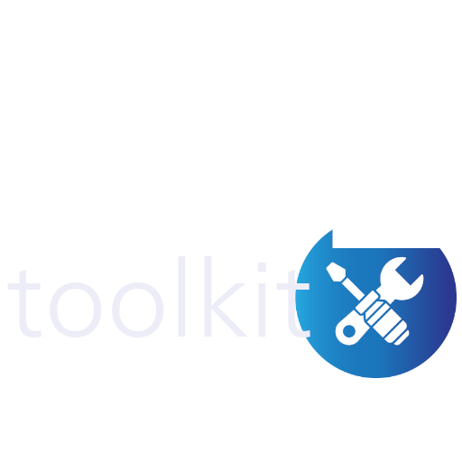

# ASLtk - Arterial Spin Labeling toolkit

{ width="350" .center}
Welcome to the ASL toolkit!

This library was designed to assist users in processing Arterial Spin Labeling (ASL) MRI images, from basic imaging protocols to the state-of-the-art models provided in the scientific literature.

The major objective of this project is to give an open-source alternative to researchers in the MRI field. A profound knowledge of computing and data modelling is not a prior demand. It is expected that a simple set of Python commands can be helpful in fast prototyping an ASL experiment or even collecting simple quantitative ASL-based information.

The full documentation of the usage, implementation and updates in the `asltk` library is given in this repository and posted online using a web-based host. In this documentation it is expected to find the basic usage of the `asltk` tool and also the major points to consider whether one may contribute directly to the project.

The general organization of this document is as follows:

## Instructions to users

Further usage instructions and a global overview of the `asltk` tool are described in the next sections. By the way, beginner programmers and people not familiar with our tool are encouraged to follow the details below.

1. Introduction to the ASLtk tool
2. Installation guide
3. Getting started tutorial
4. API reference
5. FAQ (Frequently Asked Questions)
6. Version History / Changelog
7. Community and Support

## Instructions to developers

Any improvement and suggestions are more than welcome. The ASL toolkit is a collaborative project, then it is expected that the members interested in helping to develop the framework can have a facilitated way to contribute. Please, follow the general procedure to assist code review and acceptance of new insights. More details can be found in the following section.

1. Code structure
2. How to contribute
3. Testing
4. Build and deployment instructions
5. Extending the library
6. Internals and advanced topics
7. Dependency management
8. Code documentation
9. Version control

!!! note
    All the documentation is by default generated in the American English language. Even though this may not be the first language for some users or code developers (including me), it is encouraging to follow this language format to keep the information as broad and accessible as possible. Furthermore, better documentation is also a wonderful way to help the project, so if you want to contribute to correcting typos, grammar or confounding sentences, please make a PR!

## Audience 

Even though any person can install and use the `asltk` library, it is expected that the following people can be more affected by this project:

* Academic researchers in the ASL-MRI field
* Students in their Masters, PhD or specializations regarding ASL projects
* Computer scientists or computing enthusiasts on the image-processing field

<!-- TODO Sobre Sharing the code and license -->
## Licence

The `asltk` library is distributed under the MIT License, a permissive open-source license that allows users to freely use, modify, distribute, and even incorporate the library into commercial projects. With the MIT License, you are free to do almost anything with the code as long as you include the original copyright and license notice in any significant portions of the software. This license allows both personal and commercial use, modification, and redistribution. However, it comes with **no warranty**, meaning the authors are not liable for any issues that arise from using the library. The only restriction is that you cannot hold the authors responsible for any damages or legal claims that may result from the use of the software.

## Citations

If you obtained interesting results using this tool, please consider to add at least one the following citation (ordered by priority):

1. Paper 1
2. Paper 2