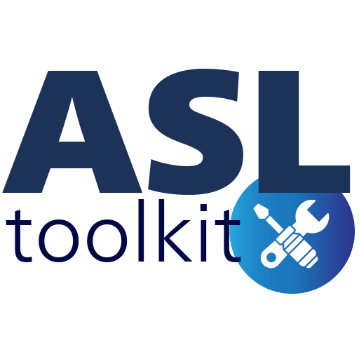

# ASLtk - Arterial Spin Labeling toolkit

{ width="350" .center}
Welcome to the ASL toolkit!

This library was designed to assist users to process Arterial Spin Labeling (ASL) MRI images, since basic imaging protocols until the state-of-art models provided in the scientific literature.

The major objective of this project is to give an open-source alternative to researchers in the MRI field. However, a profound knowledge of computing and data modeling is not a prior demand. It is expected that a simple set of python commands can be helpful to fast prototyping an ASL experiment or even collect simple quantitative ASL-based information.

The full documentation of the usage, implementation and updates in the `asltk` library is given in this repository. However, further usage and extensions based on this code can be found at the `Sharing Initiative` section, which is (by the way) encourage to you do the same! Any improvement and suggestions is more than wellcome, but please follow the general procedure to assist code review and acceptance of new insights. More details can be found at the `Development Process` section.

> [!NOTE]
> All the documentation is by default generated in American English language. Even though this may not be the first-language for some users or code developers, it is encourage to follow this language format to maintain the information as broad and acessible as possible

## Audience 

Even though any person is able to install and use the `asltk` library, it is expecte that the following people can be more affected by this project:

* Academic researchers in the ASL-MRI field
* Students in there Masters, PhD or specializations regarding ASL projects
* Computer scientists or computing enthusiats on image processing field

# How to install

# Quick example
